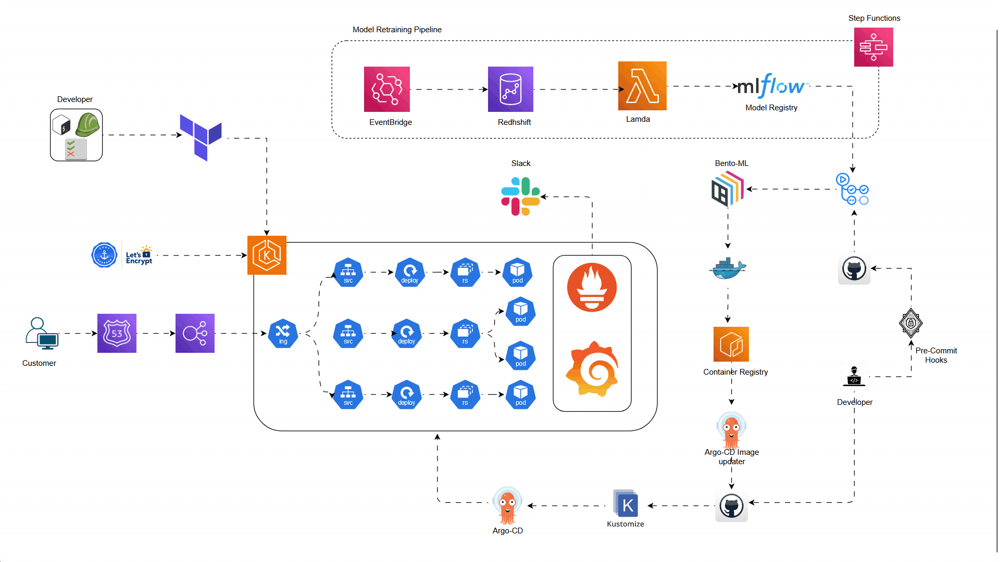

# MLOps Project: Automatic Deployment of Machine Learning Models on AWS EKS/ECS

## Project Overview

This project aims to achieve the automatic deployment of machine learning models on AWS Elastic Kubernetes Service (EKS) or Elastic Container Service (ECS) in an automated fashion. The project leverages various technologies and tools to streamline the deployment process, including Terraform, AWS IAM, load balancers, Route 53, Kubernetes, Prometheus, Grafana, Ingress controllers, Argo CD for GitOps, Docker containers, Talisman pre-commit hooks, Kustomize, AWS Step Functions, AWS EventBridge, AWS Lambda, AWS Redshift for data warehousing, Slack for alerts, BentoML, MLflow for model registry, and GitHub Actions for CI/CD.

## Architecture Diagram

## Project Flow

1. **Machine Learning Model Creation**: The machine learning team is responsible for creating machine learning models aligned with business goals.

2. **Model Deployment**: The MLOps team is responsible for deploying these ML models in an automated fashion on ECS/EKS.

3. **Continuous Integration and Continuous Delivery (CI/CD)**:
    - GitHub Actions: Used for CI/CD pipelines.
    - Argo CD: Used for continuous delivery, ensuring automated deployment of container images.
  
4. **Model Deployment and Serving**:
    - BentoML: Exposes ML models as REST API endpoints in containerized form.
    - Container Registry: Stores container images of deployed models.
    - Argo CD Image Updater Controller: Automatically deploys new container images to running EKS/ECS.

5. **Monitoring and Dashboarding**:
    - Prometheus and Grafana: Collect metrics and provide dashboarding capabilities for monitoring purposes.
  
6. **Alerting**:
    - Slack: Used for alerts and notifications.

7. **Model Retraining Pipeline**:
    - AWS Step Functions: Orchestrate the model retraining pipeline to handle model drift and data drift.
  
8. **Infrastructure as Code (IaC)**:
    - Terraform: Maintains and configures the infrastructure in an infrastructure-as-code (IaC) manner.

## Technologies and Tools Used

- **Terraform**: Infrastructure provisioning and configuration management.
- **AWS IAM**: Identity and Access Management for AWS resources.
- **Load Balancers and Route 53**: For managing traffic and DNS routing.
- **Kubernetes**: Container orchestration for deploying and managing containerized applications.
- **Prometheus and Grafana**: Monitoring and dashboarding for collecting and visualizing metrics.
- **Ingress Controllers**: Routing external HTTP(S) traffic to internal services.
- **Argo CD**: Continuous Delivery tool for GitOps workflows.
- **Docker Containers**: For packaging and deploying applications.
- **Talisman Pre-commit Hooks**: Enforces security best practices in source code repositories.
- **Kustomize**: Customization of Kubernetes object configuration.
- **AWS Step Functions**: Serverless orchestrator for coordinating AWS services into serverless workflows.
- **AWS EventBridge and AWS Lambda**: Event-driven architecture for handling events and triggers.
- **AWS Redshift**: Data warehousing for analytics and reporting.
- **Slack**: Communication and collaboration platform for team communication and alerts.
- **BentoML**: Model serving and deployment as REST API endpoints.
- **MLflow**: Model registry for managing and tracking machine learning experiments and models.
- **GitHub Actions**: CI/CD platform for automating workflows directly from GitHub repositories.

## Conclusion

By leveraging a combination of cutting-edge technologies and best practices, this MLOps project ensures the seamless deployment of machine learning models on AWS EKS/ECS. The automation of deployment processes, coupled with robust monitoring and alerting mechanisms, enables efficient management of ML workflows, facilitating rapid iteration and deployment of models while maintaining reliability and scalability.
